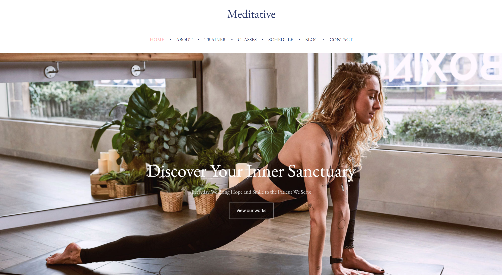
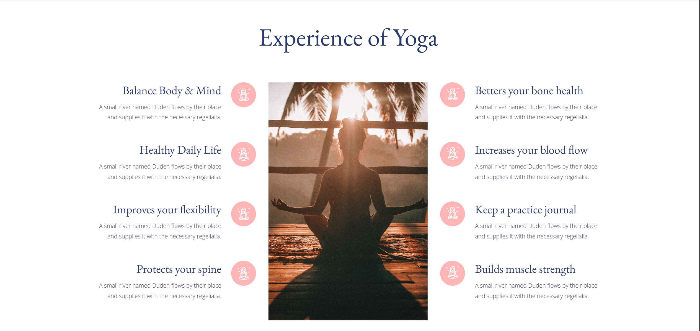
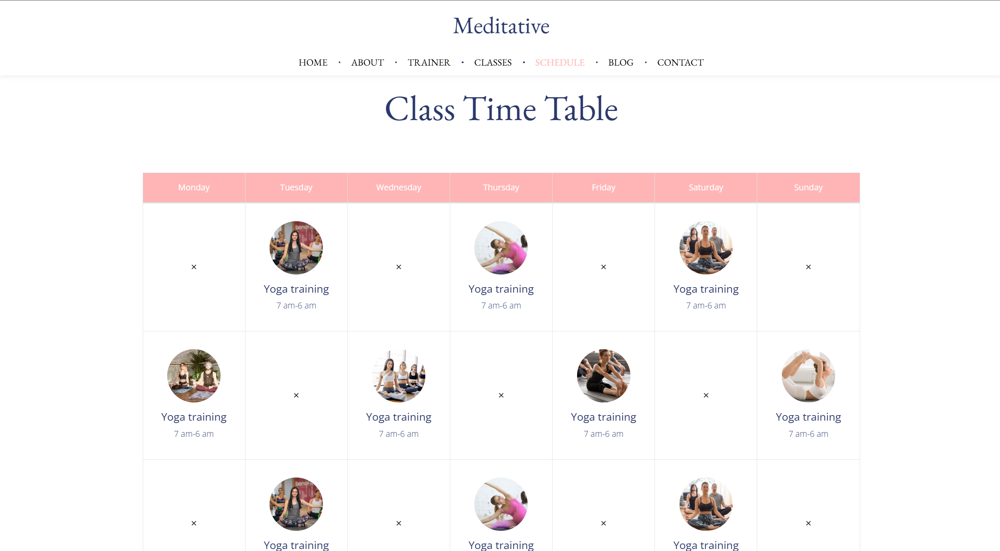

# Meditative Demo Website

This project is a **front-end demonstration** of a meditative website, designed to promote mindfulness and wellness. It includes features such as class schedules, trainer profiles, blogs, and a contact form. The project is built using **HTML**, **CSS**, and **JavaScript**, showcasing a visually appealing and interactive interface.

## Table of Contents

- [Features](#features)
- [Project Structure](#project-structure)
- [How to Use](#how-to-use)
- [Technologies Used](#technologies-used)
- [Screenshots](#screenshots)
- [About the Developer](#about-the-developer)
- [License](#license)

---

## Features

### 1. User-Friendly Navigation
- Clear and intuitive navigation bar to access all sections of the website.

### 2. Dynamic Pages
- **Homepage**: A visually engaging introduction to meditation and its benefits.
- **About Page**: Explains the purpose of the website and the importance of meditation.
- **Classes Page**: Displays the available meditation classes with descriptions and engaging visuals.
- **Schedule Page**: A timetable for users to find suitable class timings.
- **Trainer Profiles**: Introduces trainers with images, bios, and their expertise.
- **Blogs**: A section featuring articles and updates on mindfulness and wellness practices.
- **Contact Page**: A form for users to get in touch with inquiries or class registrations.

### 3. Responsive Design
- Fully responsive layout, ensuring compatibility with desktops, tablets, and mobile devices.

### 4. Optimized Media
- High-quality images and fonts are used while maintaining performance.

---

## Project Structure

```
Meditative-Demo-Website/
│
├── index.html                  # Homepage
├── about.html                  # About Us Page
├── classes.html                # Meditation Classes
├── schedule.html               # Class Schedule
├── trainer.html                # Trainer Profiles
├── blog.html                   # Blogs Overview
├── contact.html                # Contact Us Form
│
├── css/                        # CSS stylesheets
│   ├── main.css                # Primary stylesheet
│   ├── responsive.css          # Media queries for responsiveness
│   ├── additional styles...    
│
├── js/                         # JavaScript files
│   ├── main.js                 # Core functionality
│   ├── interactivity.js        # Additional scripts
│
├── images/                     # Media assets (images)
├── fonts/                      # Custom fonts
│
└── README.md                   # Documentation
```

---

## How to Use

1. **Clone the Repository**:
   ```bash
   git clone <repository-url>
   ```
2. **Open Locally**:
   Navigate to the project folder and open `index.html` in any modern web browser.
3. **Explore**:
   - Use the navigation bar to explore all pages.
   - Try the interactive features like form submission (front-end only).

---

## Technologies Used

- **HTML5**: For structuring the website content.
- **CSS3**: For styling, layout, and responsiveness.
- **JavaScript (ES6)**: For interactivity and animations.
- **Fonts and Icons**: Incorporating custom fonts for better design.
- **Images**: High-quality visuals to enhance the user experience.

---

## Screenshots

### Homepage



### Class Schedule



---

## About the Developer

This project was created by **Tavish Chawla**, a **B.Tech student at IIIT Allahabad**, as a demonstration of front-end development skills. The goal was to create a visually appealing and responsive website.

Feel free to reach out for collaborations or feedback:
- **GitHub**: [Tavish's GitHub Profile](https://github.com/tchawla827)
- **Email**: tchawla827@gmail.com

---

